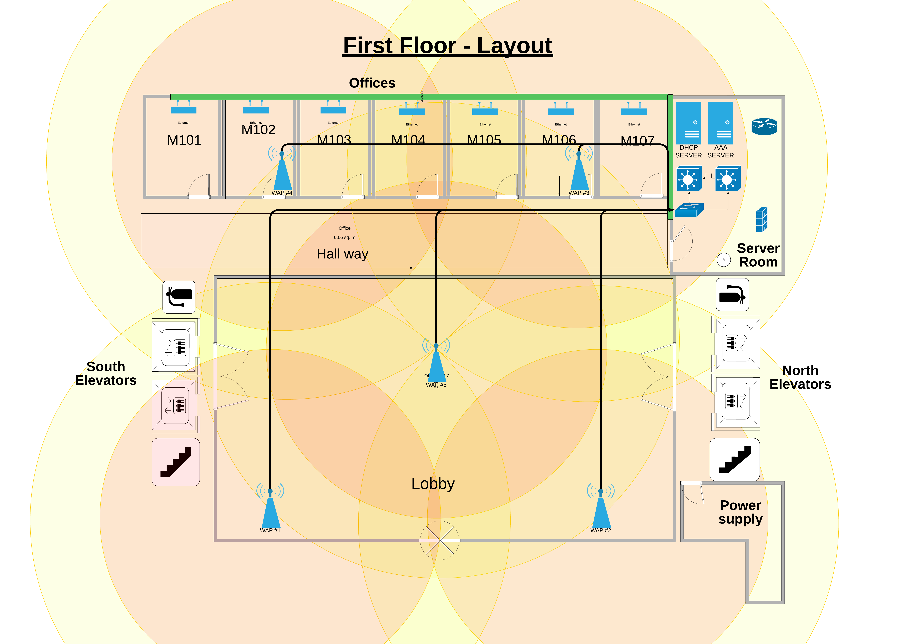
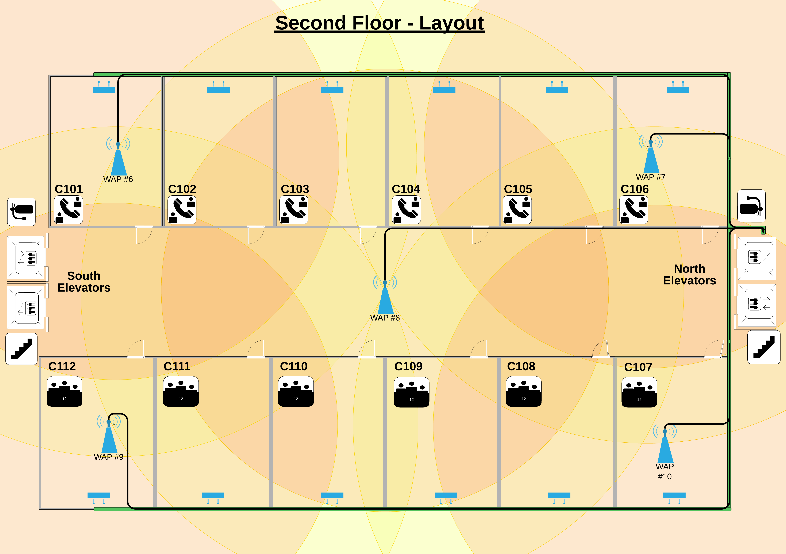
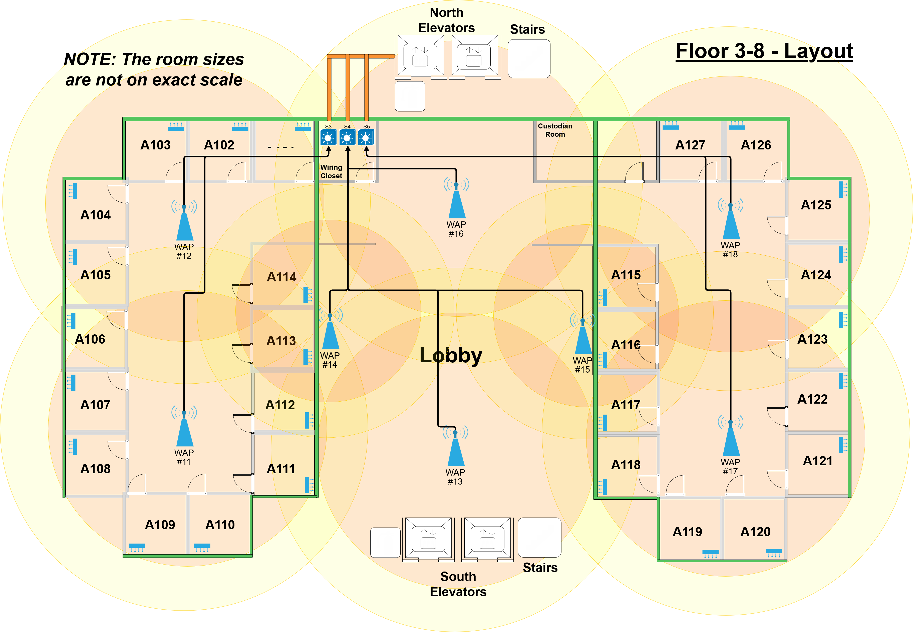
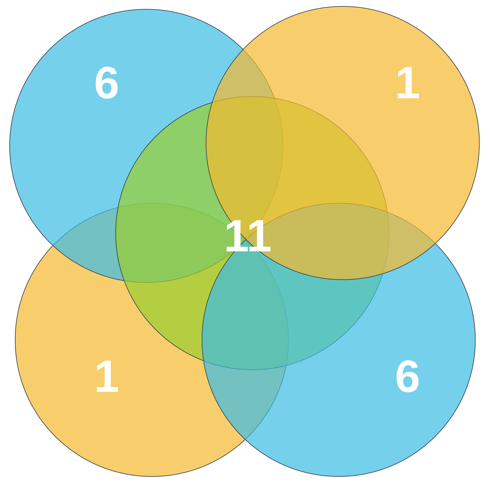

# College Apartment Network Design Project
The luxury residence hall at the University of Houston needs a network design for a student housing apartment. 

## Description
-  An 8-story building includes 162 two-bedroom, one-bathroom apartments spanning 6 floors.
-  The 1st floor features a lobby, an office area for employees, and a server room.
-  The 2nd floor is dedicated only to conference rooms

## Objectives
- The network must be secure, efficient, and cost-effective
- High-value data and infrastructure is to be isolated each other
- Network layout should accomodate future growth and expansions

## Programs and Applications Used
- Microsoft Visio
- Packet Tracer

## Features
- **Enterprise-Grade Network Segmentation**  
  - VLANs assigned by role: **infrastructure (VLAN 10)**, **employees (VLAN 20)**, **residents (VLAN 30)**, and **guests (VLAN 40)**  
  - **Dynamic VLAN assignment** via RADIUS and Active Directory for secure and automatic access control  
  - **802.1X** authentication ensures only authorized devices connect

- **Robust Hardware Configuration**  
  - **Cisco Catalyst 1200** access switches with PoE and SFP+ support (3 per floor)  
  - **Cisco Catalyst 1300** core switches with high-speed 10Gbps uplinks and dual redundancy  
  - **Dell PowerEdge R240** servers for AD/DHCP services with RAID support
  - **Cisco Business 140AC** WAPs across all floors  

- **Scalable Cabling & Infrastructure Design**  
  - Over **120,000 feet of CAT5e** and **2,000 feet of CAT6A** cable deployed across all floors  
  - Modular server racks (18U and 24U) with labeled patch panels, 7-8U of free space, and **RJ45 punch-down keystone jacks**  
  - Extra switch ports, reserved VLANs, and standards-compliant cabling support **future IoT expansion, cameras**, and hardware upgrades

- **Power Protection & Disaster Recovery**  
  - **CyberPower OR2200LCDRT2U UPS** per rack for surge protection and ~13 minutes of backup time during outages  
  - **Layered backup system**: on-site RAID-enabled servers + **AWS-based off-site backups** for disaster scenarios  

- **Comprehensive Cost Breakdown**  
  - Over **$120,000 total project cost** with detailed line items for each network component  
  - Optimized for performance without exceeding budget by **bulk ordering key components**

## Walk-through

## Diagram Overview
### First Floor

### Second Floor

### Third to Eight Floors

### 2.4GHz Channel Configuration Layout

